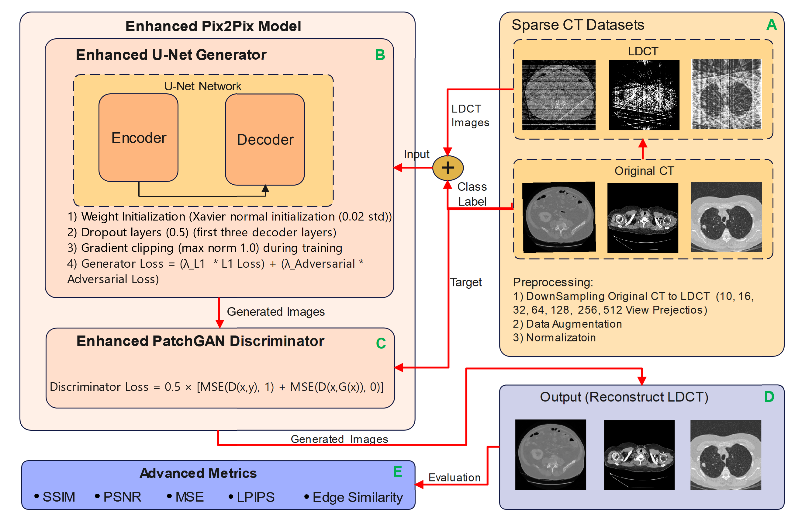

# Enh-Pix2Pix-model
# Enhanced Pix2Pix cGAN-based model
This study introduces Enhanced Pix2Pix (Enh-Pix2Pix), an enhanced conditional generative adversarial network (cGAN) specifically designed for high-quality sparse-view CT image reconstruction. Our approach incorporates several key improvements over the original Pix2Pix framework: (1) an enhanced U-Net generator featuring Xavier normal weight initialization, structured dropout regularization in decoder layers, and gradient clipping for improved training stability; and (2) an upgraded PatchGAN discriminator utilizing Least Squares GAN (LSGAN) loss with mean squared error formulation instead of binary cross-entropy for more stable adversarial training. Extensive experiments were conducted on three medical datasets (LUNA16, LIDC/IDRI, and AbdomenCT-1K) across multiple sparse-view configurations (10, 16, 32, 64, 128, 256, and 512 projections) using 5-fold cross-validation. Results demonstrate that Enh-Pix2Pix achieves superior structural preservation with SSIM scores ranging from 0.903±0.058 to 0.994±0.0002, significantly outperforming state-of-the-art methods including NAF and FACT across all anatomical regions. The proposed model maintains excellent reconstruction quality even under extreme sparse-view conditions (10 projections), demonstrating robust performance for clinical applications requiring substantial radiation dose reduction. These findings establish Enh-Pix2Pix as a promising solution for safe, efficient CT imaging in radiation-sensitive scenarios while preserving essential diagnostic information.

